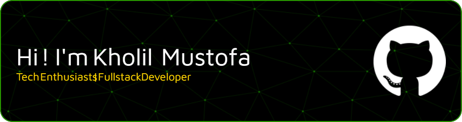

## Hi! 👋 I'm Kholil Mustofa, nice to meet you 😉

### Tentang Saya
Saya seorang [profesi Anda, misal: Software Engineer] dengan minat pada [sebutkan beberapa minat/teknologi]. Saya suka [hobi atau aktivitas terkait coding/belajar].

---

### Keahlian Saya
🚀 **Bahasa Pemrograman:** [JavaScript, Python, Java, dll.]
💻 **Framework/Library:** [React, Angular, Vue, Node.js, Spring Boot, Django, dll.]
🗄️ **Database:** [MongoDB, PostgreSQL, MySQL, dll.]
☁️ **Cloud/DevOps:** [AWS, Docker, Kubernetes, Netlify, Vercel, dll.]
✨ **Lain-lain:** [Git, REST APIs, UI/UX Design, dll.]

---

### Proyek Unggulan
* [Nama Proyek 1](link-ke-repo) - Deskripsi singkat tentang proyek ini.
* [Nama Proyek 2](link-ke-repo) - Deskripsi singkat tentang proyek ini.
* [Nama Proyek 3](link-ke-repo) - Deskripsi singkat tentang proyek ini.

---

### Sedang Belajar
Saat ini saya sedang mendalami [teknologi/topik yang sedang dipelajari].

---

### Cara Menghubungi Saya
* **LinkedIn:** [Link ke profil LinkedIn Anda]
* **Email:** [alamat.email@anda.com]
* **Twitter/X (opsional):** [Link ke profil Twitter/X Anda]

---

### Stats 📈

<!--
**kholilmustofa/kholilmustofa** is a ✨ _special_ ✨ repository because its `README.md` (this file) appears on your GitHub profile.

Here are some ideas to get you started:

- 🔭 I’m currently working on ...
- 🌱 I’m currently learning ...
- 👯 I’m looking to collaborate on ...
- 🤔 I’m looking for help with ...
- 💬 Ask me about ...
- 📫 How to reach me: ...
- 😄 Pronouns: ...
- ⚡ Fun fact: ...
-->
